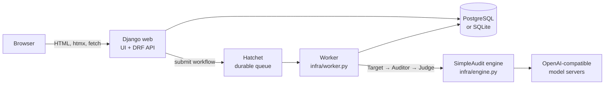

# SimpleAudit Studio — Architecture

Status: current (matches the code)  
Date: 2026-09-28

SimpleAudit Studio is a web platform around the [SimpleAudit](https://pypi.org/project/simpleaudit/)
engine: it stores versioned scenarios, versioned judges and model connections, runs audits as
durable background jobs, and records every run as a frozen, reproducible
experiment. See [domain-model.md](domain-model.md) for the data model and
[deployment.md](deployment.md) for how to run it.

## 1. Components

| Component | Code | Role |
|---|---|---|
| Web UI | `infra/ui.py`, `infra/runs_table.py`, `templates/` | Server-rendered Django views. Tailwind (CDN), htmx, Tabulator on the dashboard. Shared JS helpers in `templates/partials/ui_js.html`. |
| REST API | `*/views.py`, `*/urls.py` under `/api/` | DRF, session or token auth. OpenAPI at `/api/schema/`, docs at `/api/docs/`. |
| Worker | `infra/worker.py`, `manage.py run_worker` | Hatchet tasks `audit.scenario_execute` (one per scenario) and `audit.run_finalize`. Labelled with `WORKER_POOL` (`cpu` by default). |
| Engine adapter | `infra/engine.py` | Builds SimpleAudit clients from the run's frozen config snapshots (`auditor_kwargs`: models, the judge built from its spec, the target system prompt) and executes one scenario (with repetitions). |
| Judges | `judges/` | Versioned grading methods: criteria in an output format (a SimpleAudit judge's, or a generic severity / score / yes-no format) plus the probe prompt; the judge model is picked per run. Composed with `simpleaudit.judges` (`customize_judge`, `build_judge`). |
| Sweeper | `infra/worker.py` (`_stuck_run_sweeper`) | Runs every 60 s inside the worker: finalizes finished runs, resumes stuck ones, and ticks due monitors (`audits.monitors.run_due_monitors`). |
| Health | `infra/health.py`, `/health/`, `/api/health/` | Probes web, database, Hatchet, worker, engine and model servers, plus host resources. Admins only. |

## 2. Run lifecycle

1. **Launch.** New Experiment (`/experiments/new/`) expands the design into runs,
   shows a review step, then creates each `AuditRun` with frozen snapshots
   (`audits/services.create_audit_run`). Runs of one design share an `Experiment`.
2. **Submit.** Each scenario of the pinned `ScenarioSetVersion` becomes a Hatchet
   task (`submit_audit_run`).
3. **Execute.** The worker runs the engine per scenario and writes `AuditEvent`
   rows (progress) and one `ScenarioResult` per scenario. Cancellation is a
   durable flag checked between repetitions.
4. **Finalize.** When every scenario has a result, the run is marked
   completed or failed, inline or by the sweeper.
5. **Watch.** The run page streams events over SSE
   (`/api/projects/<id>/audit-runs/<id>/events/`), with a polling
   fallback, and refreshes the results list while the run is active.

Monitors repeat one run setup on an interval or cron schedule. Each tick is an
ordinary run, so the drift chart is a series of reproducible experiments.

## 3. Runtime modes

| Mode | Database | Hatchet | Used by |
|---|---|---|---|
| Production (Compose) | PostgreSQL | `hatchet-server` container | `docker-compose.yml` |
| Local dev | SQLite (`SIMPLEAUDIT_LOCAL_SQLITE=1`) | embedded (`dev_server --embedded`) | contributors |
| Demo (single container) | SQLite (`SIMPLEAUDIT_MINIMAL=1`) | embedded, started in-process (`infra/minimal_config.py`) | HF Space, `uvx simpleaudit-studio` |

Embedded Hatchet uses the Hatchet SDK's sidecar with its own PostgreSQL
data directory (`~/.simpleaudit-studio/embedded-pg`, override with
`SIMPLEAUDIT_EMBEDDED_PG_DIR`). The Django database stays SQLite.

## 4. Main URLs

| Path | Page |
|---|---|
| `/` | Dashboard: stat cards, interactive runs grid (`/runs/data/`, `/runs/bulk/`, `/runs/export.csv`) |
| `/experiments/new/` | Design → review → launch; Repeat creates monitors |
| `/experiments/`, `/experiments/<id>/` | Experiments and their pass-rate pivot |
| `/monitors/`, `/monitors/<id>/` | Monitors and drift charts |
| `/runs/<id>/`, `/runs/<id>/results/<rid>/` | Run detail (live) and per-scenario result |
| `/compare/?runs=a,b` | Side-by-side comparison of completed runs |
| `/scenarios/`, `/connections/` | Scenario library; connections (servers + API keys) and the models registered on them |
| `/judges/`, `/judges/<id>/` | Judges: start from a SimpleAudit judge or write own criteria, edit (new version), clone, version history, live prompt preview (`/judges/preview/`) |
| `/workspaces/`, `/admin-settings/`, `/profile/`, `/health/` | Workspaces, super-admin settings, profile, system health |
| `/healthz`, `/readyz` | Liveness and readiness probes |

## 5. Security model

- Everything is scoped to the active workspace (`request.project`, set by
  `infra/middleware.py`).
- Roles: viewer (read), auditor (write), admin (write + members). UI forms and
  the API enforce the same rule (`infra.ui.write_block_reason`,
  `scenarios.services.require_project_role`).
- API keys stay on the server: pages send only a connection id, and the server
  resolves the key (`model_registry.services.connection_api_key`).
