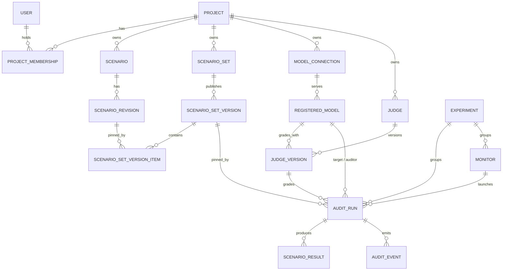

# SimpleAudit Studio — Domain Model

Status: current (matches the code)  
Date: 2026-09-28

## 1. Core invariant

**Every `AuditRun` must reference immutable inputs.**

Once an audit is submitted, its effective scenario content, model configuration, judge, generation parameters, engine version, and runtime metadata are frozen. Later edits to scenarios, judges, models or connections must not alter historical runs.

This invariant must be enforced by schema design and service behavior, not only by convention.

## 2. Entity overview



All tables use a `core_` prefix (e.g. `core_audit_run`). `SCENARIO_RESULT` and
`AUDIT_EVENT` reference the run by `run_id` (no foreign key) so the worker can
write them without locking the run row.

## 3. Scenario domain

### 3.1 `Scenario`

Identity record for a scenario across revisions.

Fields:

- `id`
- `project_id`
- `key` — stable slug/identity
- `title`
- `category`
- `tags`
- `archived_at`
- `created_by`
- `created_at`
- `updated_at`

Rules:

- `key` is unique within project.
- Archiving does not delete because historical versions may reference it.

### 3.2 `ScenarioRevision`

Immutable content snapshot of a scenario.

Fields:

- `id`
- `scenario_id`
- `revision` — monotonically increasing per scenario
- `description`
- `expected_behavior` — JSON list
- `test_prompt`
- `metadata` — JSON object
- `content_hash`
- `created_by`
- `created_at`

Rules:

- rows are append-only
- no UPDATE path in application API
- `content_hash` covers all fields that affect execution
- duplicate identical content may create a new revision but should be detectable

Execution-relevant metadata:

`ScenarioRevision.content_hash` (`infra.hashing.scenario_revision_hash`, the only implementation) covers:

- `description`
- `expected_behavior`
- `test_prompt`
- `metadata.execution` if present

All other metadata is display/organizational and excluded from the hash unless
explicitly moved under `metadata.execution`. This prevents accidental semantic
changes from labels or UI preferences.

### 3.3 `ScenarioSet`

Named collection of scenarios.

Fields:

- `id`
- `project_id`
- `name`
- `description`
- `created_by`
- `created_at`
- `updated_at`

Rules:

- mutable metadata only
- membership is defined through versions, not direct mutable links

### 3.4 `ScenarioSetVersion`

Immutable published snapshot of a set.

Fields:

- `id`
- `set_id`
- `version` — monotonically increasing per set
- `scenario_count`
- `content_hash`
- `published_by`
- `published_at`

Rules:

- rows are append-only
- `content_hash` is deterministic over ordered items and revision hashes
- audits reference this entity, never `ScenarioSet` directly

### 3.5 `ScenarioSetVersionItem`

Ordered membership of a scenario revision in a set version.

Fields:

- `id`
- `version_id`
- `scenario_id`
- `revision_id`
- `position`

Rules:

- unique `(version_id, scenario_id)`
- unique `(version_id, position)`
- append-only after publish
- position determines execution order if order matters

## 4. Model registry

### 4.1 `ModelConnection`

A provider endpoint: one base URL + auth that serves multiple models.

Fields:

- `id`
- `project_id`
- `name`
- `provider`
- `base_url`
- `secret_reference`
- `api_key_direct`
- `enabled`
- `created_by`
- `created_at`
- `updated_at`

Rules:

- unique `(project_id, name)`
- raw credentials are never exposed via API responses
- `secret_reference` names a secret in environment/vault/secret manager
- connection changes do not affect existing runs (snapshots are frozen)

### 4.2 `RegisteredModel`

A specific model available under a connection.

Fields:

- `id`
- `connection_id`
- `project_id`
- `display_name`
- `model_id`
- `description`
- `model_revision`
- `capabilities` — JSON
- `default_parameters` — JSON
- `enabled`
- `created_at`

Rules:

- unique `(connection_id, model_id)`
- display name is user-facing; `model_id` is provider-specific
- inherits auth from its connection

### 4.3 API keys

A connection authenticates with either `api_key_direct` (stored on the
connection) or `secret_reference`, the name of an environment variable read at
execution time (e.g. `OPENAI_API_KEY`). The direct key wins when both are set.
Keys are never rendered into pages: the models page and model discovery look the
connection up server-side (`model_registry.services`).

### 4.4 `Judge` and `JudgeVersion` (`judges/`)

A judge is how a run is graded. `Judge` holds the identity (`project_id`,
`name`, `description`; unique per workspace). Each `JudgeVersion` is immutable
and bundles the grading setup:

- `model_id` — the registered model that grades
- `rubric` — a built-in SimpleAudit judge config (`simpleaudit.judges`: safety,
  harm, helpfulness, factuality, abstention, binary_abstention, checklist, …), or
  `""` for SimpleAudit's default judge. The rubric also brings its output schema
  (severity, score 1–10, yes/no, checklist) and post-processing.
- `probe_prompt`, `judge_prompt` — blank means the rubric's own prompt
- `note`, `created_by`, `created_at`

Rules:

- saving a judge creates a new version only when model, rubric or prompts
  change; name and description are not versioned
- cloning starts a new judge whose history begins at v1
- runs and monitors reference versions with RESTRICT, so a used judge can't be
  deleted
- new workspaces get starter judges from `seed_platform` (one per
  general-purpose rubric), or from the Judges page's empty state

## 5. Audit run

### 5.1 `AuditRun`

The scientific experiment record.

Fields:

- `id`
- `project_id`
- `name`
- `status`
- `scenario_set_version_id`
- `target_model_id`
- `auditor_model_id`
- `judge_version_id` — the judge (version) that grades
- `judge_model_id` — that version's model, kept on the run for model-level queries
- `target_config_snapshot` — JSON without secrets
- `auditor_config_snapshot` — JSON without secrets
- `judge_config_snapshot` — JSON without secrets; its `judge` key freezes the
  judge name, version, rubric and the probe / judge prompts resolved to full text
- `generation_parameters_snapshot` — JSON
- `simpleaudit_version`
- `git_commit`
- `runtime_metadata` — JSON
- `workflow_run_id`
- `queued_at`
- `started_at`
- `finished_at`
- `total_scenarios`
- `completed_scenarios`
- `successful_scenarios`
- `failed_scenarios`
- `retried_scenarios`
- `summary_metrics` — JSON
- `error_code`
- `error_message`
- `experiment_id` — set when launched as part of an `Experiment`
- `monitor_id` — set when launched by a `Monitor`
- `created_by`
- `created_at`

Status enum:

```text
queued
preparing
target_execution
auditing
judging
aggregation
report_generation
completed
failed
cancelled
```

Rules:

- status transitions validated by service layer
- terminal states are immutable; retry always creates a new `AuditRun` referencing the same immutable inputs
- config snapshots never contain raw API keys; they keep `connection_id` and `secret_reference`, and the worker resolves the key at execution time (`infra.engine.snapshot_api_key`), so a rotated key applies to queued runs too
- workers execute only from config snapshots and pinned scenario version
- the target system prompt is a run setting: `generation_parameters_snapshot.system_prompt`
- `simpleaudit_version` and `git_commit` must be non-null for production runs
- worker must verify loaded SimpleAudit version/commit against the run manifest and fail with stable error `SIMPLEAUDIT_VERSION_MISMATCH` on mismatch
- `workflow_run_id` links to execution system but is not authoritative domain state

### 5.2 `Experiment`

A group of runs launched together from one design on New Experiment
(`/experiments/new/`). Every design input (scenario sets, target, auditor,
judges, max turns, language) takes one or more values; the cartesian product is
the list of runs, each an ordinary `AuditRun` with `experiment_id` set. The
review step can drop, rename, edit (settings, system prompt and generation config) or
duplicate runs before launch. A design that yields a single run launches it
directly, without an `Experiment`.

Fields: `project_id`, `name`, `factors` (JSON list of the inputs that differ
across its runs, computed from the final runs), `created_by`, timestamps.

Rules:

- at most 50 runs per experiment
- runs are created atomically (all or none)
- results compare the latest run of each run setup by default; pooling all
  runs is opt-in, since pooling hides drift

### 5.3 `Monitor`

One run setup repeated on a schedule to track drift. Created from New
Experiment when Repeat is not "Once" (one monitor per run setup, linked to the
experiment if there is one). Each tick creates an ordinary `AuditRun` with
`monitor_id` (and the monitor's `experiment_id`).

Fields: `project_id`, `name`, `enabled`, `scenario_set_id` with an optional
pinned `scenario_set_version_id`, target and auditor model ids, `judge_id` with
an optional pinned `judge_version_id` (empty = the judge's latest version at
each tick), `generation_parameters` (same shape as the run snapshot),
timing (`interval_hours`, or `cron_expression` read in `timezone`),
`next_run_at`, `last_run_id`, `last_tick_at`, `last_error`, `experiment_id`,
`created_by`.

Rules:

- the worker's sweeper ticks due monitors every pass (`manage.py run_monitors`
  does one pass for an external cron); claims use `select_for_update(skip_locked)`
- missed ticks are skipped, not replayed; a tick is skipped while the previous
  run of that monitor is still active
- creating or running a monitor needs admin or auditor; each tick re-checks the
  creator's role and pauses the monitor if it was lost
- at most 50 monitors per workspace; fixed intervals are 6 hours to 90 days,
  cron expressions have no minimum
- the drift baseline resets when the scenario set version or the judge version changes

### 5.4 Reproducibility manifest

Derived from `AuditRun` and pinned entities:

```json
{
  "simpleaudit_version": "...",
  "git_commit": "...",
  "scenario_set": {
    "id": 1,
    "version": 3,
    "content_hash": "sha256:..."
  },
  "scenarios": [
    {
      "scenario_id": 10,
      "revision": 2,
      "content_hash": "sha256:..."
    }
  ],
  "target": {},
  "auditor": {},
  "judge": {},
  "generation_parameters": {},
  "runtime_metadata": {}
}
```

The manifest must be downloadable and stable.

## 6. Results and events (`audits/events.py`)

### 6.1 `ScenarioResult`

One row per (run, scenario version item), upserted by the worker.

Fields: `run_id`, `version_item_id`, `status`, `attempts` (the highest attempt
seen; retries never lower it), `result` (JSON: judgment, severity, transcript
summary; with repetitions `reps`, `aggregated_severity`, `agreement_rate`),
`updated_at`. Unique on (`run_id`, `version_item_id`).

### 6.2 `AuditEvent`

Append-only progress log that drives live progress (SSE) and the run page.

Fields: `run_id`, `version_item_id` (`"_run"` for run-level events), `kind`
(e.g. `scenario_attempted`, `run_completed`, `run_failed`, `run_cancelled`,
`finalize_waiting`), `payload` (JSON), `created_at`.

## 7. Comparison

`/compare/?runs=a,b,…` compares completed runs on the scenarios they share
(`audits/comparison.py`). Nothing is stored. The page shows every input that
differs between runs (models, scenario set version, engine version, generation
parameters, judge, system prompt) and warns when the judge or auditor differs, since judge effects can
dominate target-model effects.

## 8. User preferences

`User.preferences` (JSON) holds per-user UI settings written through
`POST /me/preferences/` (a whitelist of keys, 20 KB cap). Today:
`dashboard_columns`, the dashboard grid's column order, visibility and widths.

## 9. Users and authorization

Minimum MVP:

- `User`
- `Project`
- `ProjectMembership`

Roles:

- `admin`
- `auditor`
- `viewer`

Permissions:

| Action | admin | auditor | viewer |
|---|---:|---:|---:|
| view workspace resources and results | yes | yes | yes |
| create/edit scenarios, publish versions | yes | yes | no |
| manage model connections and models | yes | yes | no |
| launch runs and experiments, create monitors | yes | yes | no |
| cancel, archive, rename runs | yes | yes | no |
| manage any monitor | yes | own only | no |
| manage members, rename/delete workspace | yes | no | no |

Superusers can do everything, in every workspace. Archived workspaces are
read-only for everyone except superusers. The UI and the API enforce the same
rule (`infra.ui.write_block_reason`, `require_project_role`).

## 10. Migrations

One `0001_initial` per app (the schema was reset before release) plus later
additive migrations. The HF Space and Compose web service run `migrate` on
start.

## 11. SimpleAudit compatibility

The platform must preserve existing SimpleAudit semantics:

- Target → Auditor → Judge
- scenario description/expected behavior/test prompt meanings
- severity labels
- judgment structure
- token accounting
- result aggregation

Any change to these semantics needs regression tests against existing expected outputs.
